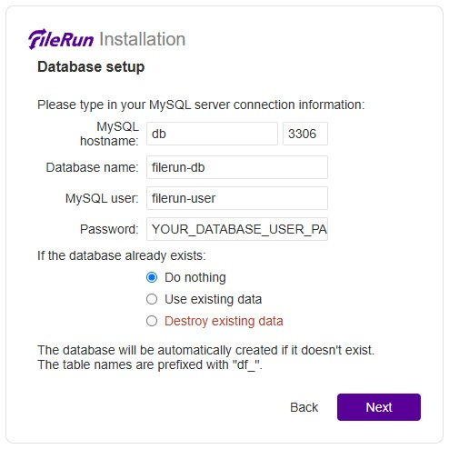
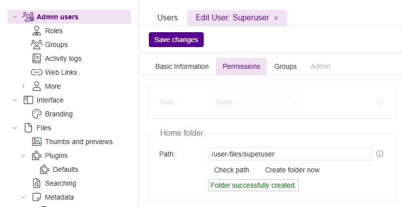

### FileRun
This repository contains a Docker image for FileRun (version 20220519), which is the last available free version of the FileRun product that was released several years ago. As FileRun has transitioned to a commercial model, where only the latest versions require a purchase, this image serves as a stable reference point for users who need access to this earlier version.

### Overview
FileRun is a robust file management system that offers a range of features to enhance productivity and collaboration. This Docker image allows you to quickly set up FileRun in a containerized environment, leveraging Docker’s capabilities to streamline deployment and management. With this image, you can access essential functionalities without the need for ongoing updates that may disrupt your workflow.

### Docker Compose Configuration
Below is the docker-compose.yml configuration for setting up the FileRun environment, which includes the necessary services such as the database, web server, Tika for document processing, and Elasticsearch for enhanced search capabilities.

```yaml
version: "3.8"

volumes:
  db:
    driver: local
  html:
    driver: local
  user-files:
    driver: local
  config:
    driver: local
  esearch:
    driver: local

services:
  db:
    image: mariadb:10.5
    container_name: filerun_mariadb
    restart: always
    environment:
      MYSQL_ROOT_PASSWORD: YOUR_DATABASE_ROOT_PASSWORD
      MYSQL_USER: filerun-user
      MYSQL_PASSWORD: YOUR_DATABASE_USER_PASSWORD
      MYSQL_DATABASE: filerun-db
    volumes:
      - db:/var/lib/mysql

  web:
    image: mrizkihidayat66/filerun
    container_name: filerun_web
    restart: always
    environment:
      FR_DB_HOST: db
      FR_DB_PORT: 3306
      FR_DB_NAME: filerun-db
      FR_DB_USER: filerun-user
      FR_DB_PASS: YOUR_DATABASE_USER_PASSWORD
      APACHE_RUN_USER: www-data
      APACHE_RUN_USER_ID: 33
      APACHE_RUN_GROUP: www-data
      APACHE_RUN_GROUP_ID: 33
    depends_on:
      - db
    ports:
      - 5003:80
    volumes:
      - html:/var/www/html
      - user-files:/user-files
      - config:/config
    healthcheck:
      test: ["CMD", "curl", "-f", "http://localhost"]
      interval: 30s
      timeout: 10s
      retries: 3

  tika:
    image: apache/tika
    container_name: filerun_tika
    restart: always

  elasticsearch:
    image: docker.elastic.co/elasticsearch/elasticsearch:6.8.23
    container_name: filerun_search
    restart: always
    environment:
      - cluster.name=docker-cluster
      - bootstrap.memory_lock=true
      - ES_JAVA_OPTS=-Xms512m -Xmx512m
    ulimits:
      memlock:
        soft: -1
        hard: -1
      nofile:
        soft: 65535
        hard: 65535
    mem_limit: 1g
    command: >
      sh -c "mkdir -p /usr/share/elasticsearch/data/nodes &&
             chown -R elasticsearch:elasticsearch /usr/share/elasticsearch/data &&
             /usr/local/bin/docker-entrypoint.sh"
    volumes:
      - esearch:/usr/share/elasticsearch/data

networks:
  default:
    driver: bridge
```

### Website Setup



### Gratitude and Support
We extend our sincere gratitude to FileRun, LDA for their hard work and dedication in developing such a useful platform. If you find FileRun beneficial, we highly recommend supporting them by purchasing a license for the latest version. For pricing details, please visit the [FileRun Pricing Page](https://filerun.com/pricing).

By using this Docker image, you are not only ensuring a stable environment but also honoring the legacy of the FileRun application, which has provided numerous users with exceptional file management capabilities over the years.
